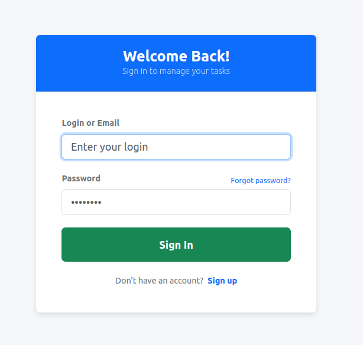
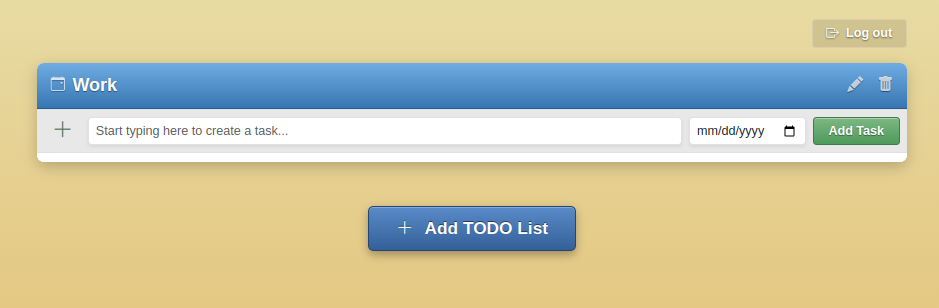
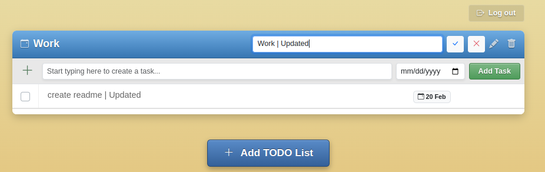
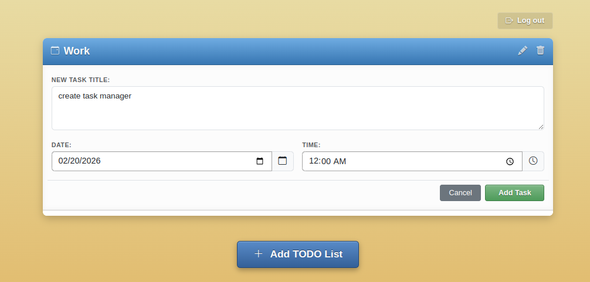
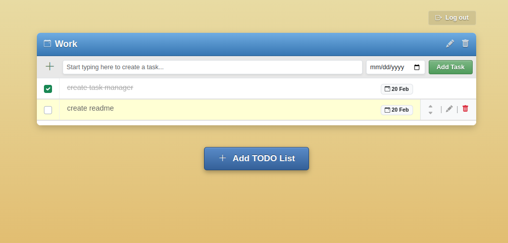
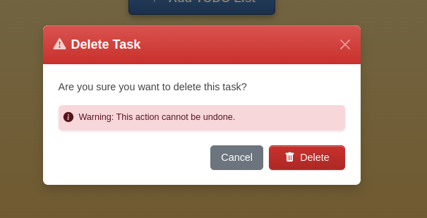

# Task Manager Application

A modern, high-performance web application designed for personal productivity. This tool allows users to manage projects and tasks effectively through a seamless, single-page experience.

## Overview

This project is a full-stack Task Management system built with **Python 3.13** and **Django 5.2**. It focuses on a clean user experience (UX) by utilizing **HTMX** and **Alpine.js** to perform asynchronous updates without page reloads.

### Key Features
* **Single Page Application (SPA) feel:** All CRUD operations (Create, Read, Update, Delete) for projects and tasks happen via AJAX/HTMX.
* **Authentication:** Secure user registration and login system powered by `django-allauth`.
* **Project Management:** Create multiple "TODO lists" (projects) to categorize tasks.
* **Task Control:** Set deadlines, prioritize tasks (Move Up/Down), and mark tasks as completed.
* **Responsive Design:** Fully optimized for desktop and mobile devices using the Bootstrap v5 grid system.
* **Safe Deletion:** Confirmation modals for deleting tasks and projects to prevent accidental data loss.

## Tech Stack

* **Backend:** Python 3.13, Django 5.2 (Class-Based Views)
* **Database:** PostgreSQL 15
* **Frontend:** HTML5, CSS3 (Bootstrap v5), JavaScript (HTMX, Alpine.js)
* **DevOps:** Docker, Docker-compose
* **Code Quality:** Ruff (Linter), Pre-commit hooks

## Installation & Setup

### Prerequisites
* Docker and Docker Compose installed on your machine.

### Running the Application

1.  **Clone the repository:**
    ```bash
    git clone https://github.com/yarikkot04/Task-Manager.git
    cd Task-Manager
    ```

2.  **Build and start the containers:**
    ```bash
    docker-compose up --build
    ```

3.  **Apply migrations:**
    The application will automatically wait for the DB to be ready, but you can run migrations manually if needed:
    ```bash
    docker-compose exec web python manage.py migrate
    ```

4.  **Access the app:**
    Open your browser and navigate to `http://localhost:8000`

## Architecture & Code Quality

* **Business Logic:** Centralized in Django models and Class-Based Views (CBVs) for maintainability and scalability.
* **Validation:** Implementation of both client-side (HTML5/JavaScript) and server-side (Django Forms) validation.
* **Optimization:** Minimized database queries and optimized frontend assets loading.
* **Linting:** The project uses `ruff` to ensure PEP 8 compliance and high code standards.

## Testing

To run the automated test suite:
```bash
docker-compose exec web python manage.py test
```

## User Interface

### 1. Authentication
The application features a clean and secure entry point. Users can sign in or create a new account to manage their personal workspace.


### 2. Project Management
Users can organize tasks into different "TODO Lists" (projects). Each project can be edited or deleted with a single click without refreshing the page.



### 3. Task Operations
* **Creation:** Add tasks quickly via the inline form or a detailed modal for setting deadlines and times.
* **Prioritization:** Move tasks up or down within a list to stay focused on what's important.
* **Completion:** Simply check a box to mark a task as done.



### 4. Interactive Feedback
Interactive confirmation modals for destructive actions (Delete) to ensure data safety.
